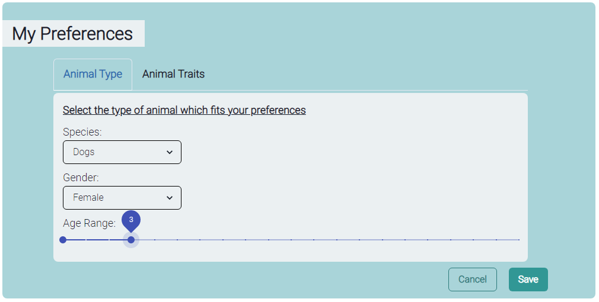

# Purrrfect Match

  <a href="https://github.com/jfv-2000/purrrfect-match/">
  
    <h1 align="center">SOEN 357 - Purrrfect Match App</h1>
  </a>

  
  
  
      

## Project Description 🚀

Purrrfect Match takes the shape of a matchmaking app, in which users are able to browse an interactive database of animals that match their requirements and lifestyle. Instead of being limited to the matchmaking process, users of this app are able to view the entire database of animals. The purpose of giving rescued animals human personas and likable profiles in the familiar setting of a matchmaking app is to help the end users feel more at ease in the adoption process. Users are made aware of the needs of the animal they are looking to adopt, such as keeping away from cats or children, minimizing the likelihood of the animal being returned to the shelter.

## Team Members 💪 🔥

<table>
  <tr>
    <td align="center"><a href="https://github.com/jfv-2000"> <b>Jean-François Vo</b></a></td>
        <td align="center"><a href="https://github.com/mimi-ta"> <b>Mimi Ta</b></a></td>
    <td align="center"><a href="https://github.com/cpereira00"> <b>Christopher Pereira</b></a></td>
  </tr>
  <tr>
   <td align="center"><a href="https://github.com/Sirlacksalot"> <b>Vincent Bruzzese</b></a></td>
   <td align="center"><a href="https://github.com/SizzlingHot"> <b>Dimitrios Kirbizakis</b></a></td>
   <td align="center"><a href="https://github.com/DawiDude"> <b>David Seleznev</b></a></td>
  </tr>
</table>

 

## How to run the app 🖥️
Run `npm start` in the command line in the project directory. This should automatically open up http://localhost:3000/ where you can run the app.

## Sources 📙

  

## Screenshots  📸

## License 📝

This repository is available under the [MIT LICENSE](./LICENSE).
